# VMI Architecture Overview

> **Status:** draft. This document covers the architecture and foundational concepts
> of the unified `pto.vmi` instruction surface. Per-op reference docs are in the
> numbered group files that follow.

`pto.vmi` sits between high-level programming models (TileLang, pto-dsl) and
the physical `pto.mi` ISA. It exposes **logically contiguous vectors** and
**elementwise compute intent**; the physical SIMD register layout (interleave,
parity, width, part, pack, dist tokens) is held and propagated by `pto.as` and
is invisible to the user.

```
TileLang  T.parallel(N) { C[i] = cast<i32>(A[i]) + B[i] }
   │  (direct translation, elementwise semantics preserved)
   ▼
pto.vmi   %w = pto.vmi.vcvt %a; %c = pto.vmi.vadd %w, %b
   │  (pto.as: layout-assignment + lowering)
   ▼
pto.mi    vcvt EVEN/ODD + two-way vadd + vstsx2 INTLV_B32
```

- **Upper → vmi**: `T.parallel`'s logical iteration space translates directly
  to `pto.vmi` logical vector ops — elementwise → Category A op, `T.cast` →
  a `vcvt` with no explicit `part`, logical length `N` →
  `!pto.vmi.vreg<N×T>`, "all active" → auto-generated tail predicate.
- **vmi → pto.mi**: `pto.as` performs layout inference + unification +
  materialization, lowering logical vectors to concrete `pto.mi` instructions
  (including `part/pack/interleave/dist`). At `K=1` this degenerates to
  zero-overhead pass-through.

---

## Logical vs Physical

A `pto.vmi` value is **logical** — a flat sequence of `L` lanes of type `T`.
Its physical backing is `K` hardware vector registers (256B / 2048-bit each):

```
K = ⌈ L · bitwidth(T) / 2048 ⌉
```

At `K=1` and full-width (no partial lanes), one `pto.vmi.vreg` maps 1:1 to
one `pto.vreg`. At `K>1`, the logical value fans out across `K` physical
registers with a layout descriptor (`#pto.vmi.layout`) tracking the mapping.

**Physical constants (A5 vector pipe):**

```
vector register file : 32 architectural vregs, 256 B (2048 bit) each
predicate file       : 8  architectural pregs, 256 bit each, 1 bit controls 1 byte
VLane                : 32 B sub-lane; 8 VLanes per vreg
E_v = 32 / sizeof(T) : lanes per VLane     (f32 → 8, f16/bf16 → 16, i8 → 32)
```

---

## Type System

### `!pto.vmi.vreg<L×T>`

Logical vector register. `L` is the logical lane count; `T` is the element type.

| T | bits | E_v (lanes per physical vreg) | Legal L |
|---|---|---|---|
| `f32` / `i32` / `ui32` / `si32` | 32 | 64 | `1, 2, 4, 8, 64, 128, 256` |
| `f16` / `bf16` / `i16` / `ui16` / `si16` | 16 | 128 | `1, 2, 4, 8, 64, 128, 256` |
| `i8` / `ui8` / `si8` / `fp8_e4m3` / `fp8_e5m2` | 8 | 256 | `1, 2, 4, 8, 64, 128, 256` |

These are the legal lane counts on the formal public VMI/PTODSL surface.
PTOAS currently accepts additional positive lane counts in internal VMI IR for
lowering intermediates and compatibility tests; those are not public PTODSL
type-construction choices.

- **Full vector**: `L · bitwidth(T) == N · 2048` (integer multiple of 256B).
- **Compact/partial vector**: `L · bitwidth(T) < 2048` — still backed by one
  physical vreg (256B); only the low `L` logical slots are valid. Physical
  slots outside the logical value are `pad/undef` and must be masked out.

**Common logical ↔ physical mappings:**

| Logical type | Byte size | K | Physical vregs | Valid slots per vreg |
|---|---:|---:|---:|---|
| `V<256×f32>` | 1024B | 4 | 4 | 64 f32 each, all valid |
| `V<256×f16>` | 512B | 2 | 2 | 128 f16 each, all valid |
| `V<256×i8>` | 256B | 1 | 1 | 256 i8, all valid |
| `V<128×f32>` | 512B | 2 | 2 | 64 f32 each, all valid |
| `V<64×f16>` | 128B | 1 | 1 | low 64 f16 valid |
| `V<64×i8>` | 64B | 1 | 1 | low 64 i8 valid |

### `V<256×f32>`: 4 physical regs (K=4)

**Logical view**


**Physical view (contiguous)** — 4 physical regs, each BlockLane = 32B = 8 f32 lanes:

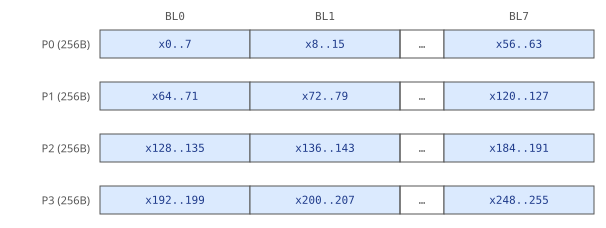

**Physical view (non-contiguous, parity EVEN/ODD)** — even lanes in P0/P2, odd
lanes in P1/P3 (typical source: `V<256×f16> -> V<256×f32>` widening preserves
parity; all 4 regs carry 64 valid lanes each):

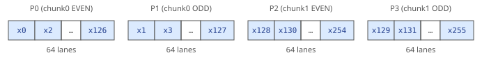

> Restore contiguous: `INTLV_B32(P0, P1) -> [x0..x127]`, `INTLV_B32(P2, P3) -> [x128..x255]`, then concatenate in chunk order.

**Physical view (non-contiguous, P0/P1/P2/P3)** — 4-way stride-4 interleave:
every 4 logical elements land in one reg each (`x0,x4,...` -> P0; `x1,x5,...` -> P1;
`x2,x6,...` -> P2; `x3,x7,...` -> P3); all 4 regs carry 64 valid lanes each
(corresponds to the sub_part / part_T 4-way axis):

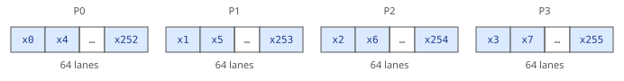

### `V<256×f16>`: 2 physical regs (K=2)

**Logical view**


**Physical view (contiguous)** — 2 physical regs, each BlockLane = 32B = 16 fp16 lanes:

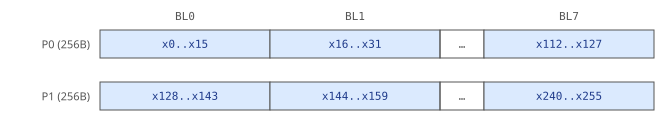

**Physical view (non-contiguous, parity EVEN/ODD)** — even lanes in P0, odd
lanes in P1 (e.g. after a deinterleaved dual load, which preserves parity; both
regs carry 128 valid lanes each):

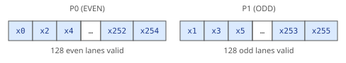

### `V<256×i8>`: 1 physical reg (K=1)

**Logical view**

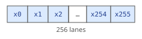

**Physical view (contiguous)** — 1 physical reg, each BlockLane = 32B = 32 i8 lanes:

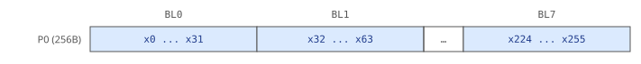

### `V<128×f32>`: 2 physical regs (K=2)

**Logical view**

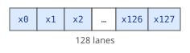

**Physical view (contiguous)** — 2 physical regs, each BlockLane = 32B = 8 f32 lanes:

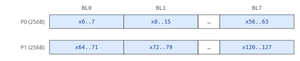

**Physical view (non-contiguous, parity EVEN/ODD)** — even lanes in P0, odd lanes in P1:

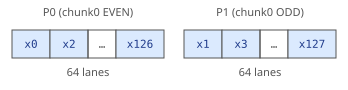

### `V<64×f16>`: 1 partial physical reg (K=1, low 64 lanes valid)

**Logical view**


**Physical view (contiguous)** — 1 physical reg, low 64 lanes valid, each
BlockLane = 16 fp16 lanes:

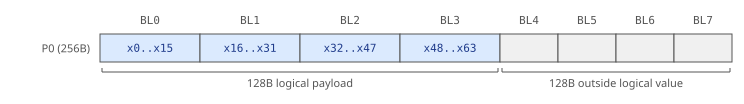

**Physical view (non-contiguous, part EVEN/ODD)** — single `V<64×f32> -> V<64×f16>`
narrowing carrier: the 64 valid fp16 sit on even/odd positions of the 128
physical lanes:

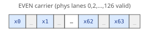

### `V<64×fp8>`: 1 partial physical reg (K=1, low 64 lanes valid)

**Logical view**

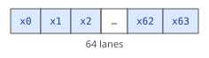

**Physical view (contiguous)** — 1 physical reg, low 64 lanes valid, each
BlockLane = 32 fp8 lanes:

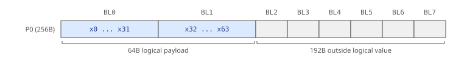

**Physical view (non-contiguous, sub_part P0)** — from `V<64×f32> -> V<64×fp8>`
via `vcvt`: instead of placing the low 64B contiguously, the 0th byte of each 4B
group holds the valid fp8:

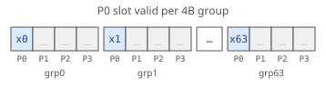

### `!pto.vmi.mask<L>`

Virtual predicate mask. Each logical mask lane corresponds to one logical
vector lane (`L` must match the governed vreg's `L`).

---

## Category A / B / C

Every VMI op belongs to one of three lowering categories that determine how
`pto.as` handles its physical layout:

| Category | Layout relationship | `pto.as` behavior | Output layout |
|---|---|---|---|
| **A — Layout-passthrough** | Does not modify register layout | Fan-out: emit the same `pto.mi` op once per physical reg (`K × op`); mask follows per-reg (with `ppack`/`punpack` as needed) | Unchanged: preserves input parity/half/sub-part layout |
| **B — Layout-rewritable** | Modifies layout predictably | Fan-out along other axes; instantiate matching modes (`PART_EVEN/ODD`, `Bin_N0/N1`, `PK`/`UNPK`, `INTLV`/`DINTLV`) | Rewritten to the op's natural output layout |
| **C — Contiguous-required** | Requires stride-1 contiguous input (no in-place mode satisfies it) | `pto.as` inserts `.contiguous()` materialization (store+reload or explicit repack) before the op | Flattened contiguous chunk (`is_contiguous`) |

> **C-class note:** C-class ops cannot tolerate a non-contiguous physical
> layout — any parity/half/sub-part arrangement must first be materialized to
> contiguous before the op runs. `pto.as` therefore treats a C-class op as a
> **layout barrier**: upstream A/B ops may keep their compact layout right up to
> the C-class boundary, where a `.contiguous()` is forced.

---

## Mask & Predication (`pmode`)

All compute ops accept an optional governing mask operand `[pmode]`. The mask
is a `!pto.vmi.mask<L>` with the same `L` as the data operand.

**Mask shape and granularity:**

- A mask has the same logical lane count `L` as every governed data value.
- `pred` is an abstract per-lane mask and carries no layout.
- Concrete `b8`, `b16`, and `b32` granularities must match the governed
  element width; layout-assigned masks must match the governed data layout.

**`pmode` values:**

| `pmode` | Inactive lane behavior | Default? |
|---|---|---|
| `"zero"` | Inactive lanes produce 0 (hardware-native ZEROING) | ✓ (default) |
| `"merge"` | Inactive lanes preserve the destination's prior value | |

On A5, MERGE is **emulated**: the hardware predicates only in ZEROING mode, so the
compiler synthesizes merge as a predicate complement plus a `vor`/`vsel` blend
of the zeroed result with the old destination (see [Appendix C](10-appendices.md)).
On A6, some ops support native MERGE.

**A5 load restriction**: `vload` has **no** mask operand — A5 loads are
unpredicated. A logical tail mask associated with a load is never lowered as a
"masked load"; `pto.as` migrates it to the consuming compute op, the store, or
shortens the load length. `vstore` **is** predicated on A5.

---

## The `group` Attribute

Reduce ops (`vcadd`, `vcmax`, `vcmin`) and broadcast (`vbrc`) accept an
optional `{group=C}` attribute where `C` is the **number of groups** (not the
per-group lane count):

- **Reduce**: Splits `L` lanes into `C` groups, each producing one scalar.
  Output is `V<C×T>` — a compact vector of `C` scalars.
- **Broadcast**: Takes a compact `V<C×T>` and fans each scalar back across
  `L/C` lanes, producing `V<L×T>`.

Legal `C` values: `1`, `2`, `4`, `8` (must divide `L`; must match the result
type's `C`).

**`group → Category` decision table** (W = bytes per sub-group):

| W vs BlockLane (32B) | Category | Lowering |
|---|---|---|
| `W == 32B` (sub-group = 1 VLane) | B | `vcgadd`/`vcgmax`/`vcgmin` — one op per reg, no cross-reg combine |
| `W > 32B`, aligned | B | Fold `(k-1)× vadd/vmax/vmin` then `vcg*` |
| Unaligned | C | Materialize → contiguous → reduce |

---

## Group Index

| # | Group | Ops | Category | Mask |
|---|---|---|---|---|
| 1 | **Load / Store** | `vload`, `vstore` | A (+B on dintlv/intlv) | load: none; store: `Pg` |
| 2 | **Index-gen** | `vci` | A | none |
| 3 | **Eltwise Compute** | `vadd`, `vsub`, `vmul`, `vdiv`, `vmax`, `vmin`, `vabs`, `vneg`, `vrelu`, `vexp`, `vln`, `vsqrt`, `vand`, `vor`, `vxor`, `vnot`, `vshl`, `vshr`, `vadds`, `vmuls`, `vmaxs`, `vmins`, `vshls`, `vshrs`, `vcmp`, `vcmps`, `vsel`, `vselr` | A | `Pg` (except `vselr`: none) |
| 4 | **Broadcast** | `vbrc` | A (ungrouped) / B (grouped) | none |
| 5 | **Reduce** | `vcadd`, `vcmax`, `vcmin` | B (VLane-aligned) / C (unaligned) | `Pg req` |
| 6 | **Convert** | `vcvt`, `vinterpret_cast` | B / A | `Pg` / none |
| 7 | **SFU** | `vexpdif`, `vaxpy`, `vlrelu`, `vprelu`, `vmull`, `vmula`, `vchist`, `vdhist`, `vgather`, `vscatter` | A (fused) / B (vmull, vchist, vdhist) / C (gather/scatter) | `Pg` (`vchist`/`vdhist`/SFU) / `Pg` (gather/scatter) |
| 8 | **Predicate Ops** | `create_mask`, `create_group_mask` | gen | gen |
| 9 | **Data Rearrange** | `vintlv`, `vdintlv` | A | `Pg` |
